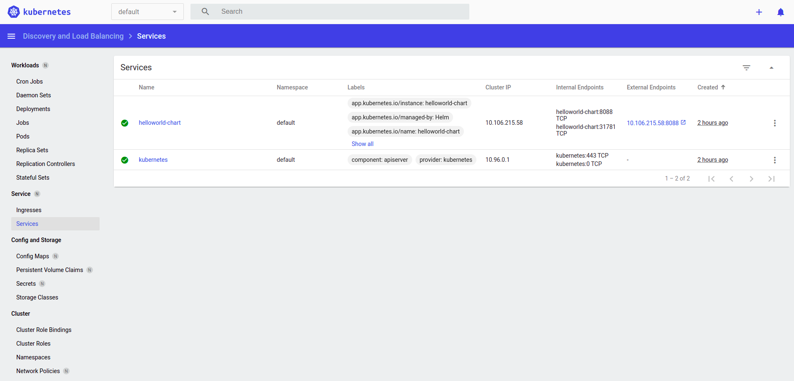
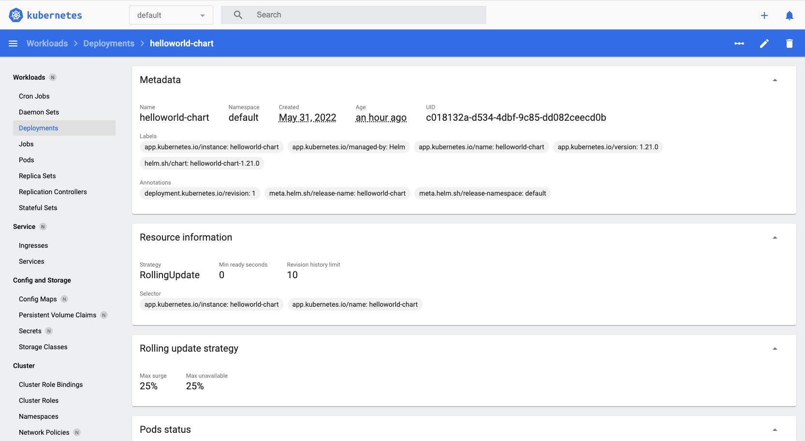
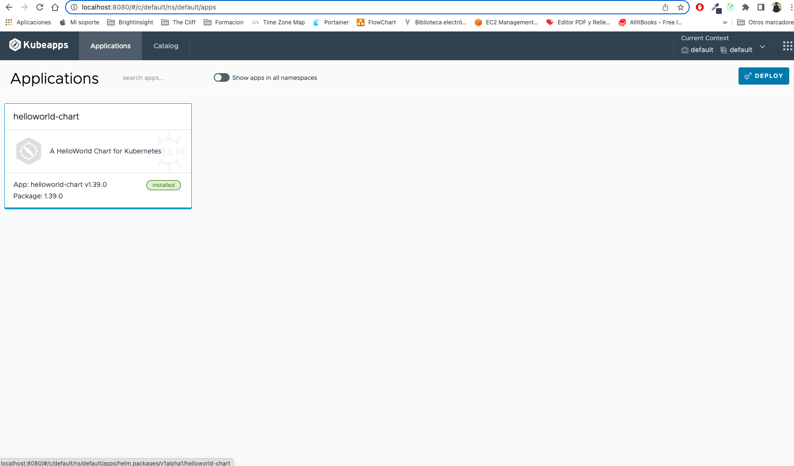

## Description

PoC HelloWorld Helm Package deployed in Minikube

## Deployment steps: Start minikube

- **STEP01**: Start Minikube cluster
```shell
minikube start
```

- **STEP02**: Activate dashboard addon in minikube
```shell
minikube addons enable dashboard
```

- **STEP03**: Run Dashboard addon
```shell
minikube dashboard
```
[Minikube Dashboard Link](http://127.0.0.1:39221/api/v1/namespaces/kubernetes-dashboard/services/http:kubernetes-dashboard:/proxy/#/service?namespace=default)

- **STEP04**: Activate tunelling to expose kubernetes loadbalancer service
```shell
sudo minikube tunnel
```

## Deployment steps: Deploy Chartmuseum Helm Chart Repository

- **STEP01**: install chartmuseum chart repository

create a folder called charts to save your charts pushed

```shell
docker run --rm -it \
  -p 8088:8080 \
  -e DEBUG=1 \
  -e STORAGE=local \
  -e STORAGE_LOCAL_ROOTDIR=/charts \
  -v $(pwd)/charts:/charts \
  ghcr.io/helm/chartmuseum:v0.14.0
```

- **STEP02**: add new chartmuseum repository to helm CLI

```shell
helm repo add chartmuseum http://localhost:8088

helm search repo chartmuseum
```

## Deployment steps: Install nova CLI to compare versions (Optional)

- **STEP1**: [install nova CLI](https://nova.docs.fairwinds.com/installation/#installation) to check chart versions
```shell
curl -L "https://github.com/FairwindsOps/nova/releases/download/1.0.0/nova_1.0.0_linux_amd64.tar.gz" > nova.tar.gz
tar -xvf nova.tar.gz
sudo mv nova /usr/local/bin/
```

- **STEP2**: list helm relases installed
```shell
nova find
```

## Deployment steps: Compile docker Image and publish in Docker Registry (Docker Hub)

- **STEP01**: Build docker image
```shell
docker build -t helloworld-chart:1.20.0 .
```

- **STEP02**: tag the docker image to be published under your Docker Hub account
```shell
docker tag helloworld-chart:1.34.0 ofertoio/helloworld-chart:1.20.0
```

or 

we could compile and tag in one step like this
```shell
docker build -t ofertoio/helloworld-chart:1.20.0 .
```

- **STEP03**: login in your Docker Hub account
```shell
docker login -u ofertopio -p
```

- **STEP04**: Push docker image to your Docker Hug account
```shell
docker push ofertoio/helloworld-chart:1.20.0
```

## Deployment steps: Package Helm Chart and publish

To create a new helm chart package execute and set **image** and **service** chart attributes from values.yaml and update **Chart.yaml** with correct version

```shell
helm create helm-chart
```

In Mac the Helm cache it's in this folder

```shell
/Users/miguel/Library/Caches/helm/repository
```

- **STEP01**: Package your helm chart
The version of the chart must be the same as the appVersion set in the Chart.yaml file of chart

```shell
helm package helm-chart --version 1.20.0
```

## Deployment steps: publish chart in chart repository

- **STEP02**: publish your chart

```shell
curl --data-binary "@helloworld-chart-0.20.0.tgz" http://localhost:8088/api/charts
```

we could published the chart using a chartmuseum helm plugin called push

```shell
helm plugin install https://github.com/chartmuseum/helm-push
```

then push the chart using the plugin
```shell
helm push helloworld-chart chartmuseum
```

- **STEP03**: update your local chart repositories

```shell
helm repo update
```

## Deploy chart in minikube 

- **STEP01**: deploy helm chart release in minikube
```shell
helm install helloworld-chart helloworld-chart-1.20.0.tgz
```

Release deployed



Release Version



## Upgrade chart in minikube 

- **STEP01**: Upgrade the chart in kubernetes

```shell
helm upgrade helloworld-chart chartmuseum/helloworld-chart
```

- **STEP2**: remove helm chart release from minikube
```shell
helm uninstall helloworld-chart
```

## Helm domain models: Chart and Release model

Chart Collection obtain by **helm search repo** comand from helm chart repository

```shell
[
  {
    "name": "chartmuseum/helloworld-chart",
    "version": "0.1.0",
    "app_version": "1.16.0",
    "description": "A Helm chart for Kubernetes"
  }
]
```

Release collection obtain by **helm list** command from kubernetes

```shell
[
  {
    "name": "helloworld-chart",
    "namespace": "default",
    "revision": "1",
    "updated": "2022-05-28 08:46:33.236501 +0200 CEST",
    "status": "deployed",
    "chart": "helloworld-chart-0.1.0",
    "app_version": "1.16.0"
  }
]
```

## Deployment steps: kubernetes deployment

A simple sample to be deployed on minikube using deployment and not helm charts

```shell
kubectl create deployment hello-minikube --image=polyverse/node-echo-server
```

```shell
kubectl expose deployment hello-minikube --type=NodePort --port=8080
```

```shell
kubectl port-forward service/hello-minikube 7080:8080

http://localhost:7080/Hello
```

## Install Kubeapps

We could use Kubeapps from Bitnami to control visually all chartd of our deployment

```shell
helm repo add bitnami https://charts.bitnami.com/bitnami
    
helm install -n kubeapps --create-namespace kubeapps bitnami/kubeapps
```

Set a port-forward befaore access to service
```shell
kubectl port-forward --namespace kubeapps service/kubeapps 8080:80

http://localhost:8080
```


